# G.io API Management Performance Tests

Run performance tests for Gravitee.io API Management with [K6](https://github.com/grafana/k6), [Prometheus](https://github.com/prometheus/prometheus) and [Grafana](https://github.com/grafana/grafana) on Kubernetes.

Table of content :

- [1. Architecture](#1-architecture)
- [2. Results](#2-results)
  - [2.1. APIm 4.3.4 | Azure AKS](#21-apim-434--azure-aks)
    - [2.1.1. 1/2 (500m) vCPU core \& 512 Mi memory (Standard\_F4s\_v2)](#211-12-500m-vcpu-core--512-mi-memory-standard_f4s_v2)
    - [2.1.2. 4 vCPU core \& 3 Gi memory (Standard\_F4s\_v2)](#212-4-vcpu-core--3-gi-memory-standard_f4s_v2)
    - [2.1.3. 16 vCPU core \& 3 Gi memory (Standard\_F16s\_v2)](#213-16-vcpu-core--3-gi-memory-standard_f16s_v2)
- [3. Do the tests yourself](#3-do-the-tests-yourself)
  - [3.1. Setup](#31-setup)
    - [3.1.1. \[Optional, not recommended\] Create a local kubernetes cluster with kind](#311-optional-not-recommended-create-a-local-kubernetes-cluster-with-kind)
    - [3.1.2. Install Gravitee.io API Management](#312-install-graviteeio-api-management)
    - [3.1.3. \[Optional\] Install Gravitee.io Kubernetes Operator (GKO)](#313-optional-install-graviteeio-kubernetes-operator-gko)
    - [3.1.4. Install Redis](#314-install-redis)
    - [3.1.5. Install K6 Operator](#315-install-k6-operator)
    - [3.1.6. Install the upstream API service](#316-install-the-upstream-api-service)
    - [3.1.7. Install Prometheus](#317-install-prometheus)
    - [3.1.8. Install Grafana](#318-install-grafana)
  - [3.2. Execute load testings scenarios](#32-execute-load-testings-scenarios)
    - [3.2.1. SIMPLE, use the make command](#321-simple-use-the-make-command)
    - [3.2.2. Manually](#322-manually)
  - [3.3. Uninstall](#33-uninstall)

---

## 1. Architecture

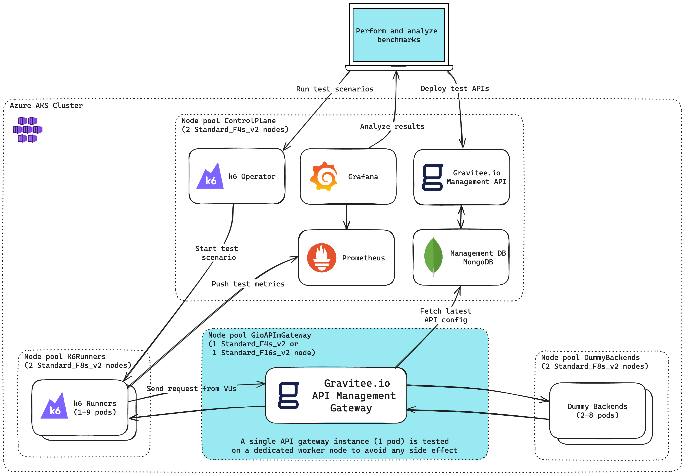

## 2. Results

### 2.1. APIm 4.3.4 | Azure AKS

#### 2.1.1. 1/2 (500m) vCPU core & 512 Mi memory (Standard_F4s_v2)

| Test scenario                  | RPS      | P(95) req duration | P(99) req duration | Graph                                                                                                                  |
| ------------------------------ |:--------:|:------------------:|:------------------:|:----------------------------------------------------------------------------------------------------------------------:|
| Passthrough<br/>10 VUs         | 7.1k RPS | 1.04 ms            | 2.17 ms            | 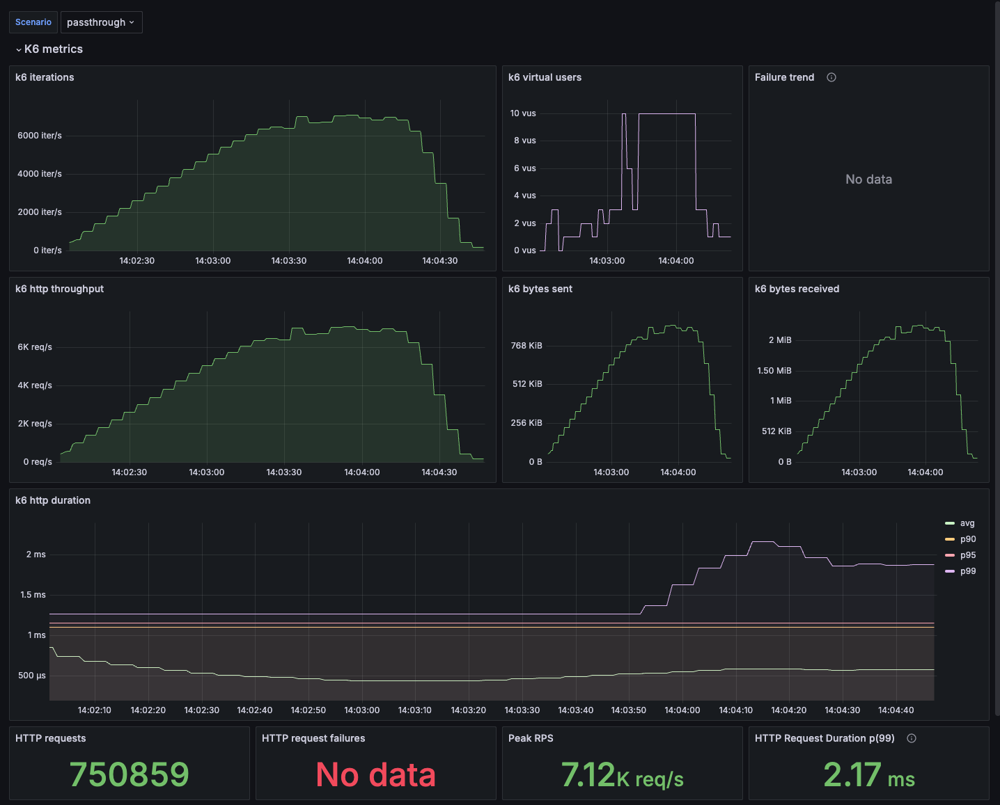   |
| API key<br/>10 VUs             | 6.6k RPS | 1.07 ms            | 9.55 ms            | 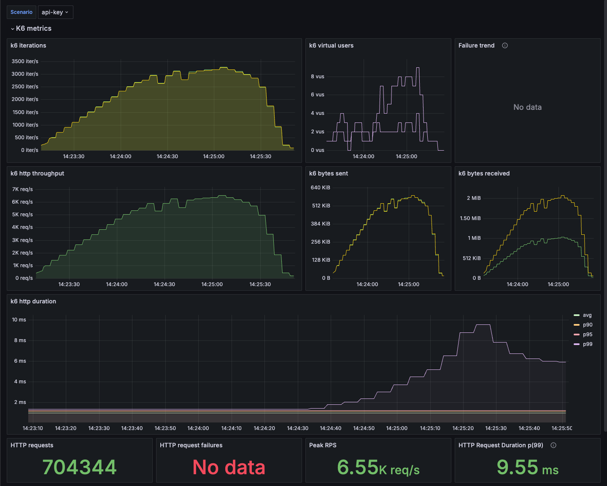           |
| Rate Limit<br/>10 VUs          | 5.0k RPS | 1.10 ms            | 4.33 ms            | 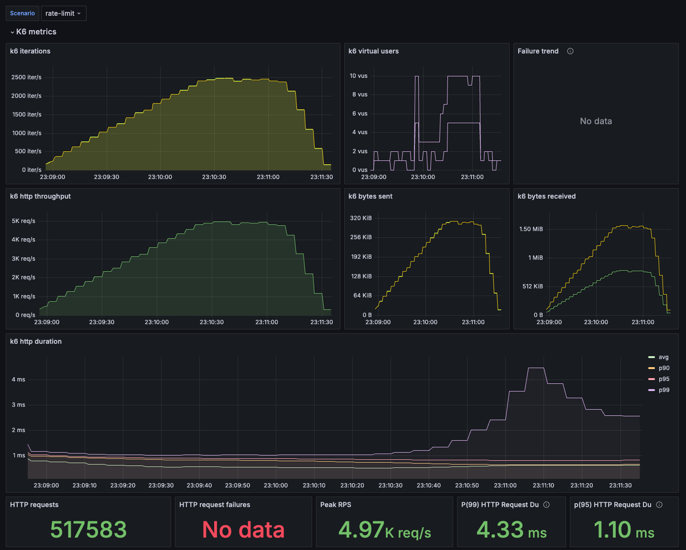                     |
| JSON Transformation<br/>10 VUs | 3.5k RPS | 1.31 ms            | 3.59 ms            | 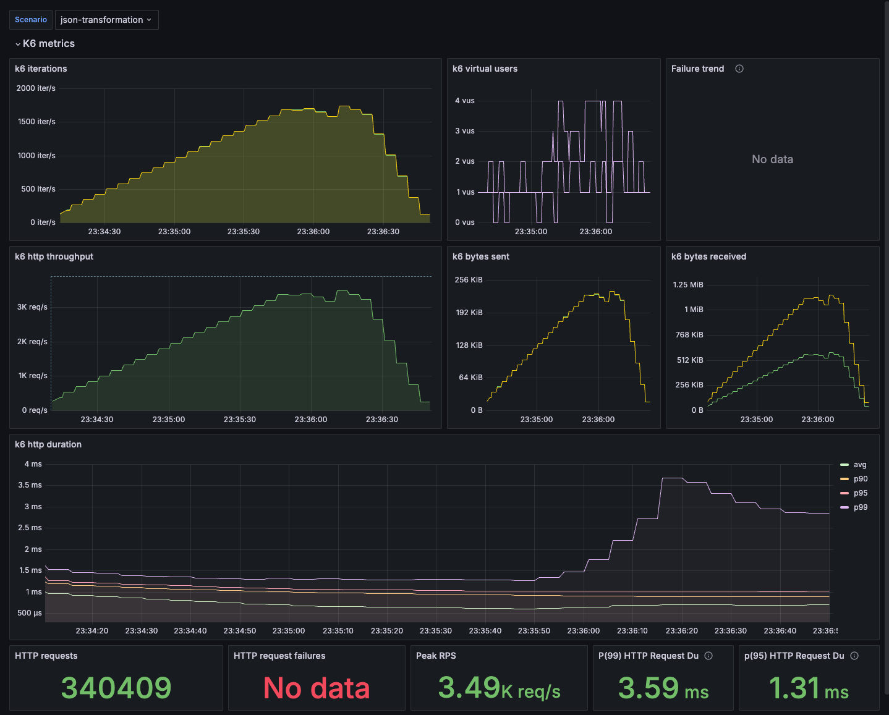 |

#### 2.1.2. 4 vCPU core & 3 Gi memory (Standard_F4s_v2)

| Test scenario                   | RPS       | P(95) req duration | P(99) req duration | Graph                                                                                                        |
| ------------------------------- |:---------:|:------------------:|:------------------:|:------------------------------------------------------------------------------------------------------------:|
| Passthrough<br/>100 VUs         | 25.1k RPS | 9.06 ms            | 15.62 ms           | 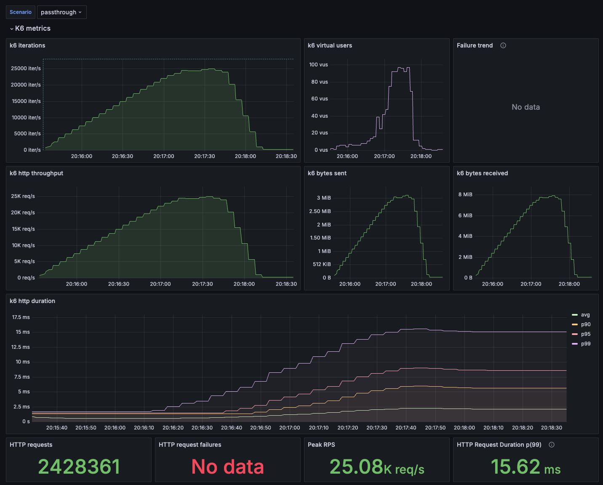   |
| API key<br/>150 VUs             | 23.8k RPS | 13.50 ms           | 19.80 ms           | 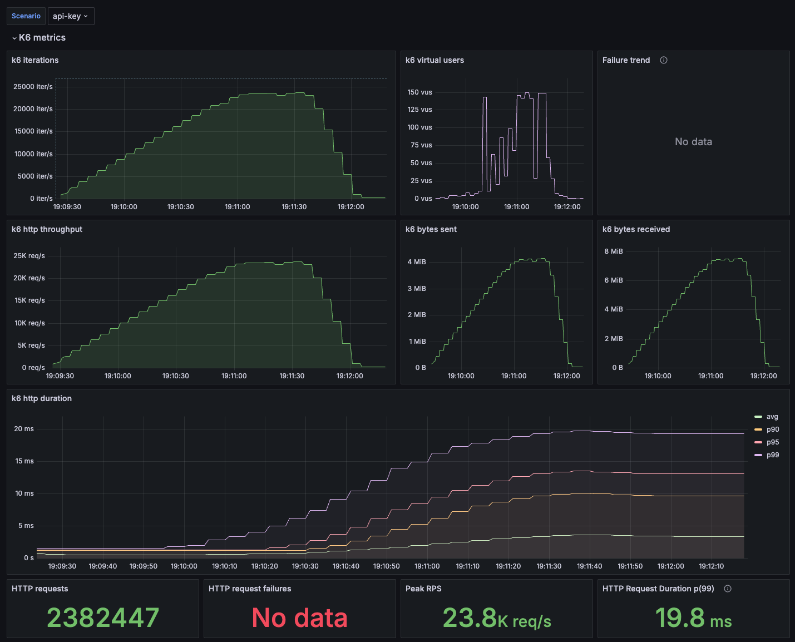           |
| Rate Limit<br/>150 VUs          | 18.6k RPS | 13.47 ms           | 19.38 ms           | 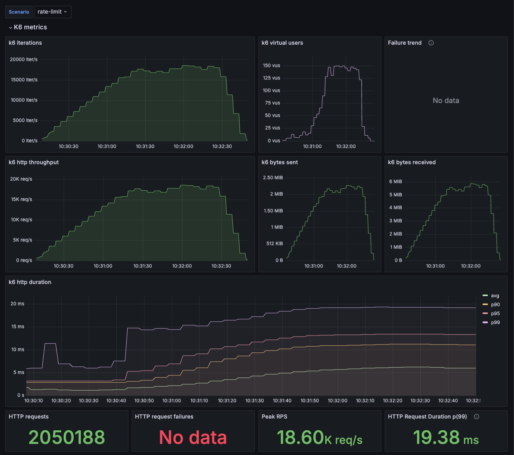                     |
| JSON Transformation<br/>150 VUs | 14.1k RPS | 21.85 ms           | 29.99 ms           | 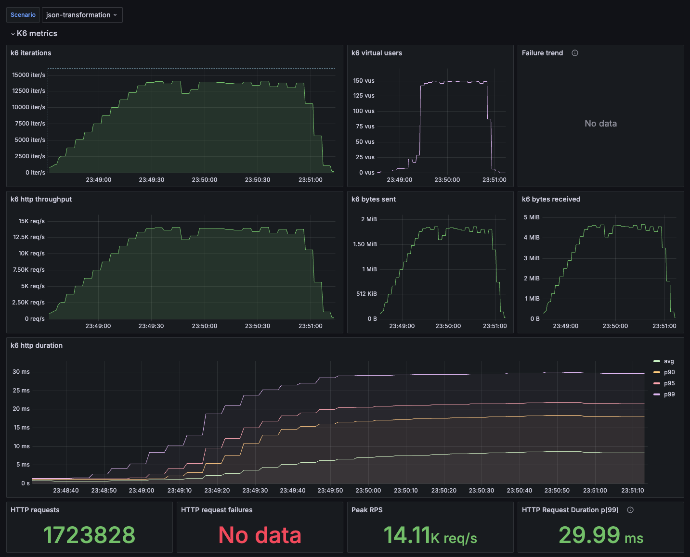 |

#### 2.1.3. 16 vCPU core & 3 Gi memory (Standard_F16s_v2)

| Test scenario                   | RPS       | P(95) req duration | P(99) req duration | Graph                                                                                                          |
| ------------------------------- |:---------:|:------------------:|:------------------:|:--------------------------------------------------------------------------------------------------------------:|
| Passthrough<br/>200 VUs         | 88.3k RPS | 9.76 ms            | 8.77 ms            | 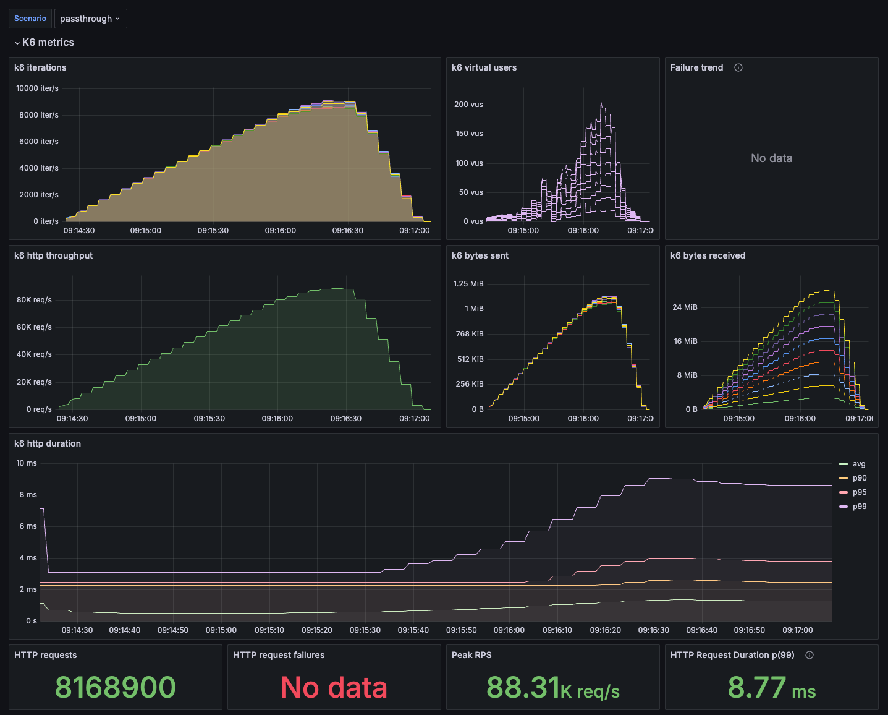   |
| API key<br/>200 VUs             | 80.8k RPS | 3.84 ms            | 9.05 ms            | 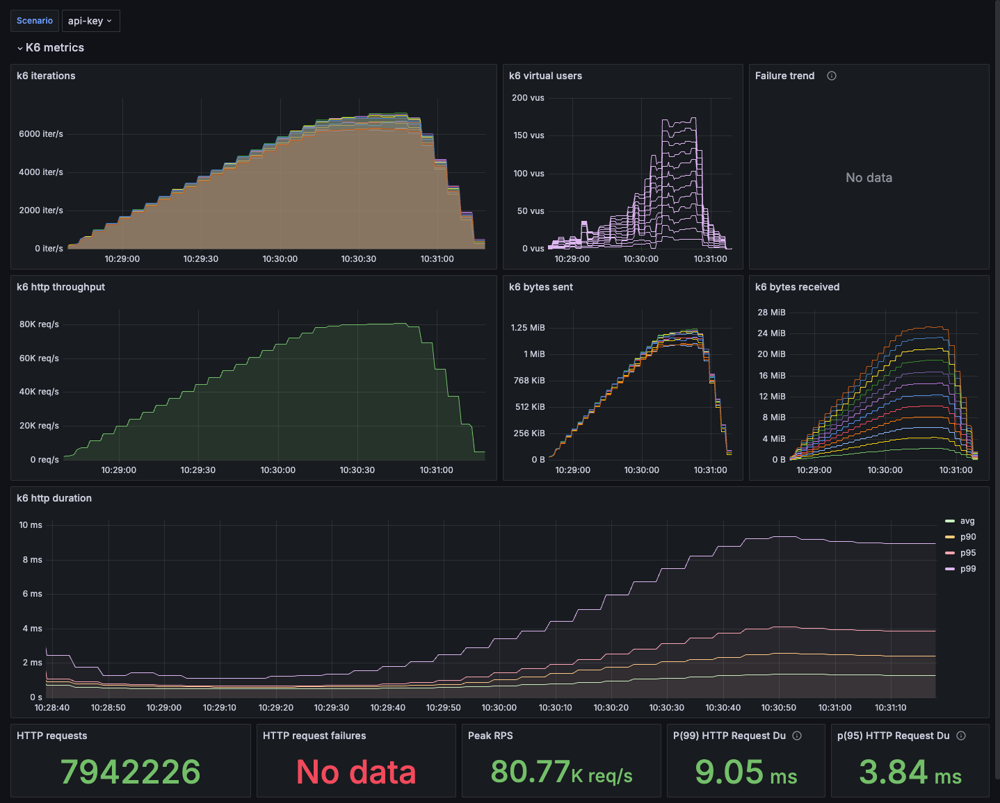           |
| Rate Limit<br/>200 VUs          | 61.8k RPS | 4.42 ms            | 6.55 ms            | 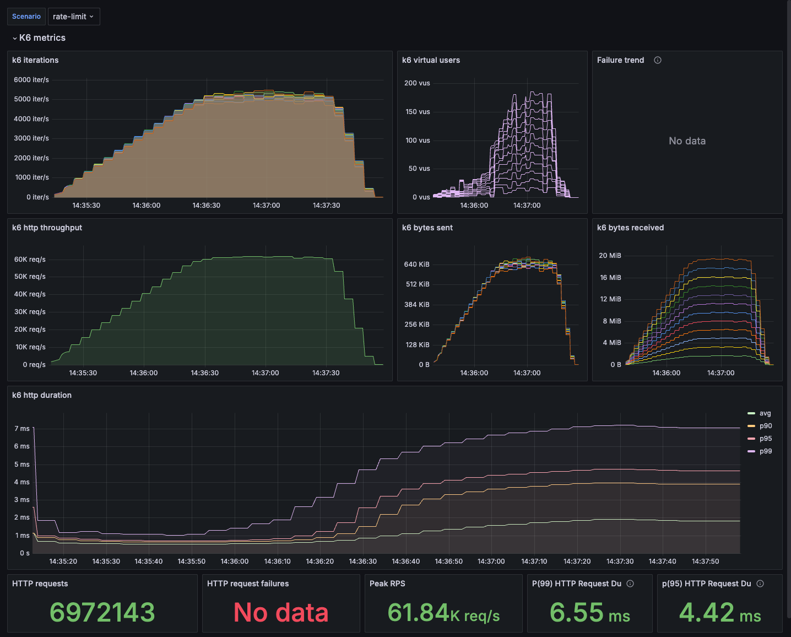                     |
| JSON Transformation<br/>150 VUs | 50.9k RPS | 4.07 ms            | 8.74 ms            | 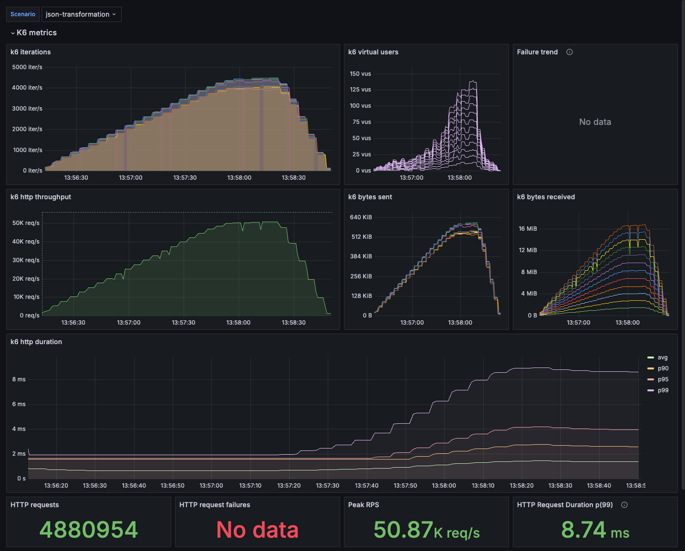 |

> [!NOTE]
> Coming soon, more scenarios and tests running in AWS EKS and GCP GKE.

---

## 3. Do the tests yourself

### 3.1. Setup

To perform these tests yourself, you need :

- A Kubernetes cluster with at least 4 worker nodes. For local testing (not recommended, as it is biased and limited), you can use minikube, k3s or kind, for example.
- Kubectl ([installation guide](https://kubernetes.io/docs/tasks/tools/#kubectl))
- Helm ([installation guide](https://helm.sh/docs/intro/install/))

#### 3.1.1. [Optional, not recommended] Create a local kubernetes cluster with kind

> [!WARNING]
> Using a local Kubernetes cluster is not recommended, as it is biased and limited. Hardware resources will be shared between all components, and the network topology is not representative of a real deployment. However, for small-scale one-off tests, it may be sufficient to validate minimal requirements (a few hundred or even thousands of calls per second).

1. Install kind [following the official documentation](https://kind.sigs.k8s.io/docs/user/quick-start/#installation).

2. Create a kind cluster, with [labels on nodes](https://kind.sigs.k8s.io/docs/user/configuration/#extra-labels) to apply [nodeSelector](https://kubernetes.io/docs/concepts/scheduling-eviction/assign-pod-node/#nodeselector) ([example](https://kubernetes.io/docs/tasks/configure-pod-container/assign-pods-nodes/#create-a-pod-that-gets-scheduled-to-your-chosen-node)).
   
    Customize the cluster by providing the `gravitee-apim-perf-test-cluster.yaml` file :
   
    https://github.com/gravitee-io-labs/gravitee-api-management-performance-benchmark/blob/80aeedb180b0d0d02b3533cf7a426eb9ad1d5ddf/kind/gravitee-apim-perf-test-cluster.yaml#L1-L27
   
   ```sh
   kind create cluster --config kind/gravitee-apim-perf-test-cluster.yaml
   ```
   
    Configure kubectl to use this cluster.
   
   ```sh
   kubectl cluster-info --context kind-gravitee-apim-perf-test
   ```
   
    List nodes with their labels
   
   ```sh
   kubectl get nodes --show-labels
   ```

3. Install Nginx ingress controler, unless you prefer to [use Port Forwarding](https://kubernetes.io/docs/tasks/access-application-cluster/port-forward-access-application-cluster/)
   
   ```sh
   kubectl apply -f https://raw.githubusercontent.com/kubernetes/ingress-nginx/main/deploy/static/provider/kind/deploy.yaml
   ```

#### 3.1.2. Install Gravitee.io API Management

Use the Helm Chart to install Gravitee.io API Management on Kubernetes.

1. Add and update the `graviteeio` helm repo
   
   ```sh
   helm repo add graviteeio https://helm.gravitee.io && \
   helm repo update graviteeio
   ```

2. Install the Gravitee.io API Management Gateway
   
    Customize the installation by providing the `values.yaml` file :
   
    https://github.com/gravitee-io-labs/gravitee-api-management-performance-benchmark/blob/80aeedb180b0d0d02b3533cf7a426eb9ad1d5ddf/gio-apim/values.yaml#L1-L31
   
   ```sh
   helm install apim -f gio-apim/SIZING/values.yaml graviteeio/apim --create-namespace --namespace gio-apim
   ```
   
    If you need to upgrade the deployment after any change in the configuration :
   
   ```sh
   helm upgrade apim -f gio-apim/SIZING/values.yaml graviteeio/apim --namespace gio-apim
   ```
   
    Watch all containers come up
   
   ```sh
   kubectl get pods --namespace=gio-apim -l app.kubernetes.io/instance=apim -o wide -w
   ```

#### 3.1.3. [Optional] Install Gravitee.io Kubernetes Operator (GKO)

We will also use the Gravitee.io Kubernetes Operator (GKO) to deploy the APIs used during the performance test.

1. Deploy the Gravitee.io Kubernetes Operator (GKO)
   
   ```sh
   helm install gko graviteeio/gko --create-namespace --namespace gio-apim
   ```

#### 3.1.4. Install Redis

Redis is used to store Rate Limits counters.

```sh
helm install redis -f redis/values.yaml oci://registry-1.docker.io/bitnamicharts/redis --create-namespace --namespace redis
```

If you need to upgrade the deployment after any change in the configuration :

```sh
helm upgrade redis -f redis/values.yaml oci://registry-1.docker.io/bitnamicharts/redis --namespace redis
```

#### 3.1.5. Install K6 Operator

1. Add and update the `grafana` helm repo
   
   ```sh
   helm repo add grafana https://grafana.github.io/helm-charts && \
   helm repo update grafana
   ```

2. Install k6 Kubernetes operator
   
   > [!NOTE]
   > The k6 operator will by default create a namespace `k6-operator-system`
   
    Customize the installation by providing the `values.yaml` file :
   
    https://github.com/gravitee-io-labs/gravitee-api-management-performance-benchmark/blob/10ce3e25fc3d8ea1c5701e2c793ebb2c6e67a05c/k6/values.yaml#L1-L2
   
   ```sh
   helm install k6-operator -f k6/values.yaml grafana/k6-operator
   ```

#### 3.1.6. Install the upstream API service

1. Deploy the `go-bench-suite` service
   
    Create a dedicated namespace to execute the dummy upstream API service
   
   ```sh
   kubectl create ns dummy-upstream-api-service
   ```
   
   ```sh
   kubectl apply -f go-bench-suite --namespace=dummy-upstream-api-service
   ```

#### 3.1.7. Install Prometheus

1. Add and update the `bitnami` helm repo
   
   ```sh
   helm repo add bitnami https://charts.bitnami.com/bitnami && \
   helm repo update bitnami
   ```

2. Install Prometheus
   
    Customize the installation by providing the `values.yaml` file :
   
    https://github.com/gravitee-io-labs/gravitee-api-management-performance-benchmark/blob/10ce3e25fc3d8ea1c5701e2c793ebb2c6e67a05c/prometheus/values.yaml#L1-L10
   
   ```sh
   helm install prometheus -f prometheus/values.yaml bitnami/kube-prometheus --create-namespace --namespace prometheus
   ```
   
    If you need to upgrade the deployment after any change in the configuration :
   
   ```sh
   helm upgrade prometheus -f prometheus/values.yaml bitnami/kube-prometheus --namespace prometheus
   ```

#### 3.1.8. Install Grafana

1. Deploy Prometheus datasource and dashboard
   
   ```sh
   kubectl create ns grafana && \
   kubectl create secret generic datasource-secret --from-file=./grafana/datasource-secret.yaml -n grafana && \
   kubectl create configmap k6-prometheus-dashboard --from-file=./grafana/k6-prometheus-dashboard.json -n grafana
   ```

2. Install Grafana
   
    Customize the installation by providing the `values.yaml` file :
   
    https://github.com/gravitee-io-labs/gravitee-api-management-performance-benchmark/blob/80aeedb180b0d0d02b3533cf7a426eb9ad1d5ddf/grafana/values.yaml#L1-L12
   
   ```sh
   helm install grafana -f grafana/values.yaml bitnami/grafana --create-namespace --namespace grafana
   ```
   
    If you need to upgrade the deployment after any change in the configuration :
   
   ```sh
   helm upgrade grafana -f grafana/values.yaml bitnami/grafana --namespace grafana
   ```

### 3.2. Execute load testings scenarios

#### 3.2.1. SIMPLE, use the make command

```sh
make run-test TEST_NAME=your-test-name BASE_URL=url-apim-management-api
```

Example

```sh
make run-test TEST_NAME=2-api-key BASE_URL=http://localhost:50083
```

#### 3.2.2. Manually

1. Deploy the API

> [!WARNING]
> In its current version, the CRDs that come with the Kubernetes operator don't allow you to manage API plans and subscriptions.
> For simple tests that don't require plans and subscriptions, the operator is sufficient and can deploy APIs that contain policies.
> For more advanced cases, such as API subscriptions protected by API key or JWT plans, you'll need to use the Management API.

    - Using the Gravitee.io Kubenertes Operator (GKO)
    
    ```sh
    kubectl create ns k6-perf-tests
    ```
    
    ```sh
    kubectl apply -f scenarios/0-passthrough/api-passthrough-v1.yaml --namespace=gio-apim
    kubectl apply -f scenarios/1-mock/apim-mock-v1.yaml --namespace=gio-apim
    ```
    
    - Using the Management API
    
    To do this, you can use [the Postman collection provided](scenarios/G.io APIm Perf Tests.postman_collection.json) (running the collection or the folders it contains automates these tasks).
    
    If not exposed externally, you can use port-forward to have access to the Management API.
    
    ```sh
    kubectl port-forward service/apim-api 50083:api --namespace=gio-apim
    ```

1. Deploy test scripts and execute scenario
   
    Create a dedicated namespace to execute the performance tests
   
   ```sh
   kubectl create ns k6-perf-tests
   ```
   
    Deploy the k6 test script to a configmap
   
   ```sh
   kubectl create configmap your-test-name --from-file scenarios/your-test-folder/your-test-script.js -n k6-perf-tests
   ```
   
    Deploy the k6 Test Run resource, this will trigger the k6 operator and create a job running k6 runner(s).
   
   ```sh
   kubectl apply -f scenarios/your-test-folder/your-k6-testrun.yaml -n k6-perf-tests
   ```
   
    At the end of the load testings scenario delete both resources.
   
   ```sh
   kubectl delete configmap your-test-name -n k6-perf-tests && \
   kubectl delete -f scenarios/your-test-folder/your-k6-testrun.yaml -n k6-perf-tests
   ```

### 3.3. Uninstall

Just delete the used namespaces or the cluster itself.

If you used a local Kubernetes with kind

```sh
kind delete cluster --name gravitee-apim-perf-test
```

> [!NOTE]
> If you don't remember the cluster name, you have it in the [kind cluster configuration file](./kind/gravitee-apim-perf-test-cluster.yaml), or find it with `kind get clusters`.
