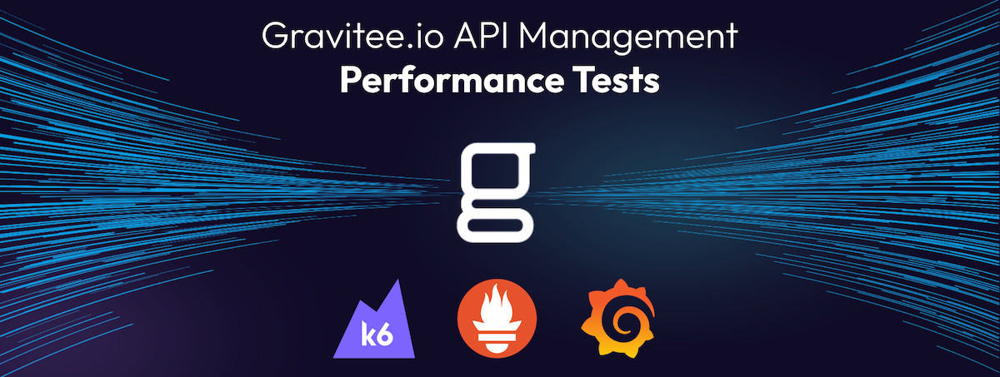

# G.io API Management Performance Tests

Run performance tests for Gravitee.io API Management with [K6](https://github.com/grafana/k6), [Prometheus](https://github.com/prometheus/prometheus) and [Grafana](https://github.com/grafana/grafana) on Kubernetes.

Table of content :
- [G.io API Management Performance Tests](#gio-api-management-performance-tests)
  - [How we did it and our results](#how-we-did-it-and-our-results)
    - [Azure AKS](#azure-aks)
  - [Do the tests yourself](#do-the-tests-yourself)
    - [Setup](#setup)
      - [\[Optional, not recommended\] Create a local kubernetes cluster with kind](#optional-not-recommended-create-a-local-kubernetes-cluster-with-kind)
      - [Install Gravitee.io API Management](#install-graviteeio-api-management)
      - [\[Optionnel\]Install Gravitee.io Kubenertes Operator (GKO)](#optionnelinstall-graviteeio-kubenertes-operator-gko)
      - [Install K6 Operator](#install-k6-operator)
      - [Install the upstream API service](#install-the-upstream-api-service)
      - [Install Prometheus](#install-prometheus)
      - [Install Grafana](#install-grafana)
    - [Execute load testings scenarios](#execute-load-testings-scenarios)
    - [Uninstall](#uninstall)

---
## How we did it and our results

### Azure AKS

1. Azure `Standard_F4s_v2` (4 vCPUs / 8 GB Memory)

1 kubernetes node of type `Standard_F4s_v2` dedicated to 1 instance of gateway.

| Test scenario                                                |    RPS    | P95 latency | Graph                                                        |
| ------------------------------------------------------------ | :-------: | :---------: | ------------------------------------------------------------ |
| [Testing the dummy upstream service directly](scenarios/dummy-upstream/test.js) - 30k RPS<br />1. 200 RPS during 10 seconds<br />2. Ramp up to 30k RPS over 3 minutess | 29.8k RPS |   366 μs    |  |
| [Passthrough, no policy applied](scenarios/0-passthrough/test.js) - 10k RPS<br />1. 200 RPS during 10 seconds<br />2. Ramp up to 10k RPS over 3 minutes<br />3. Maintain 10k RPS over 30 seconds<br />4. Ramp down to 200 RPS over 30 seconds | 11.1k RPS |   1.31 ms   |  |
| [Passthrough, no policy applied](scenarios/0-passthrough/test.js) - 20k RPS<br />1. 200 RPS during 10 seconds<br />2. Ramp up to 20k RPS over 3 minutes<br />3. Maintain 20k RPS over 30 seconds<br />4. Ramp down to 200 RPS over 30 seconds | 20.2k RPS |   30.5 ms   |  |
| [API key check to authenticate an application - 10k RPS](scenarios/2-api-key/test.js)<br />1. 200 RPS during 10 seconds<br />2. Ramp up to 10k RPS over 3 minutes<br />3. Maintain 10k RPS over 30 seconds<br />4. Ramp down to 200 RPS over 30 seconds | 10.3k RPS |   61.1 ms   |  |
|                                                              |           |             |                                                              |
|                                                              |           |             |                                                              |


> [!NOTE]
> Comming soon, more scenarios and tests running in AWS EKS and GCP GKE.

---
## Do the tests yourself

### Setup

To perform these tests yourself, you need :
- A kubernetes cluster with at least 4 worker nodes. For local testing (not recommended, as it is biased and limited), you can use minikube, k3s or kind, for example.
- Kubectl ([installation guide](https://kubernetes.io/docs/tasks/tools/#kubectl))
- Helm ([installation guide](https://helm.sh/docs/intro/install/))

#### [Optional, not recommended] Create a local kubernetes cluster with kind

> [!WARNING]
> Using a local kubernetes cluster is not recommended, as it is biased and limited. Hardware resources will be shared between all components, and the network topology is not representative of a real deployment. However, for small-scale one-off tests, it may be sufficient to validate minimal requirements (a few hundred or even thousands of calls per second).

1. Install kind [following the officiel documentation](https://kind.sigs.k8s.io/docs/user/quick-start/#installation).

2. Create a kind cluster, with [labels on nodes](https://kind.sigs.k8s.io/docs/user/configuration/#extra-labels) to apply [nodeSelector](https://kubernetes.io/docs/concepts/scheduling-eviction/assign-pod-node/#nodeselector) ([example](https://kubernetes.io/docs/tasks/configure-pod-container/assign-pods-nodes/#create-a-pod-that-gets-scheduled-to-your-chosen-node)).

    Customise the cluster by providing the `gravitee-apim-perf-test-cluster.yaml` file :

    https://github.com/gravitee-io-labs/gravitee-api-management-performance-benchmark/blob/80aeedb180b0d0d02b3533cf7a426eb9ad1d5ddf/kind/gravitee-apim-perf-test-cluster.yaml#L1-L27

    ```sh
    kind create cluster --config kind/gravitee-apim-perf-test-cluster.yaml
    ```

    Configure kubectl to use this cluster.
    ```sh
    kubectl cluster-info --context kind-gravitee-apim-perf-test
    ```

    List nodes with their labels
    ```sh
    kubectl get nodes --show-labels
    ```

3. Install Nginx ingress controler, unless you prefer to [use Port Forwarding](https://kubernetes.io/docs/tasks/access-application-cluster/port-forward-access-application-cluster/)

    ```sh
    kubectl apply -f https://raw.githubusercontent.com/kubernetes/ingress-nginx/main/deploy/static/provider/kind/deploy.yaml
    ```

#### Install Gravitee.io API Management

Use the Helm Chart to install Gravitee.io API Management on kubernetes.

1. Add and update the `graviteeio` helm repo

    ```sh
    helm repo add graviteeio https://helm.gravitee.io && \
    helm repo update graviteeio
    ```

2. Install the Gravitee.io API Management Gateway

    Customise the installation by providing the `values.yaml` file :

    https://github.com/gravitee-io-labs/gravitee-api-management-performance-benchmark/blob/80aeedb180b0d0d02b3533cf7a426eb9ad1d5ddf/gio-apim/values.yaml#L1-L31

    ```sh
    helm install apim -f gio-apim/4CPU-8GB/values.yaml graviteeio/apim --create-namespace --namespace gio-apim
    ```

    Watch all containers come up

    ```sh
    kubectl get pods --namespace=gio-apim -l app.kubernetes.io/instance=apim -o wide -w
    ```

#### [Optionnel]Install Gravitee.io Kubenertes Operator (GKO)

We will also use the Gravitee.io Kubernetes Operator (GKO) to deploy the APIs used during the performance test.

1. Deploy the Gravitee.io Kubernetes Operator (GKO)

    ```sh
    helm install gko graviteeio/gko --create-namespace --namespace gio-apim
    ```

#### Install K6 Operator

1. Add and update the `grafana` helm repo

    ```sh
    helm repo add grafana https://grafana.github.io/helm-charts && \
    helm repo update grafana
    ```

2. Install k6 kubernetes operator

    > [!NOTE]
    > The k6 operator will by default create a namespace `k6-operator-system`

    Customise the installation by providing the `values.yaml` file :

    https://github.com/gravitee-io-labs/gravitee-api-management-performance-benchmark/blob/10ce3e25fc3d8ea1c5701e2c793ebb2c6e67a05c/k6/values.yaml#L1-L2

    ```sh
    helm install k6-operator -f k6/values.yaml grafana/k6-operator
    ```

#### Install the upstream API service

1. Deploy the `go-bench-suite` service

    Create a dedicated namespace to execute the dummy upstream API service

    ```sh
    kubectl create ns dummy-upstream-api-service
    ```

    ```sh
    kubectl apply -f go-bench-suite --namespace=dummy-upstream-api-service
    ```

#### Install Prometheus

1. Add and update the `bitnami` helm repo

    ```sh
    helm repo add bitnami https://charts.bitnami.com/bitnami && \
    helm repo update bitnami
    ```

2. Install Prometheus

    Customise the installation by providing the `values.yaml` file :

    https://github.com/gravitee-io-labs/gravitee-api-management-performance-benchmark/blob/10ce3e25fc3d8ea1c5701e2c793ebb2c6e67a05c/prometheus/values.yaml#L1-L10

    ```sh
    helm install prometheus -f prometheus/values.yaml bitnami/kube-prometheus --create-namespace --namespace prometheus
    ```

#### Install Grafana

1. Deploy Prometheus datasource and dashboard

    ```sh
    kubectl create ns grafana && \
    kubectl create secret generic datasource-secret --from-file=./grafana/datasource-secret.yaml -n grafana && \
    kubectl create configmap k6-prometheus-dashboard --from-file=./grafana/k6-prometheus-dashboard.json -n grafana
    ```

2. Install Grafana

    Customise the installation by providing the `values.yaml` file :

    https://github.com/gravitee-io-labs/gravitee-api-management-performance-benchmark/blob/80aeedb180b0d0d02b3533cf7a426eb9ad1d5ddf/grafana/values.yaml#L1-L12

    ```sh
    helm install grafana -f grafana/values.yaml bitnami/grafana --create-namespace --namespace grafana
    ```

### Execute load testings scenarios

1. Deploy the API

    > [!WARNING]
    > In its current version, the CRDs that come with the Kubernetes operator don't allow you to manage API plans and subscriptions.
    > For simple tests that don't require plans and subscriptions, the operator is sufficient and can deploy APIs that contain policies.
    > For more advanced cases, such as API subscriptions protected by API key or JWT plans, you'll need to use the Management API.

    - Using the Gravitee.io Kubenertes Operator (GKO)

    ```sh
    kubectl apply -f scenarios/0-passthrough/api-passthrough-v1.yaml --namespace=gio-apim
    kubectl apply -f scenarios/1-mock/apim-mock-v1.yaml --namespace=gio-apim
    ```

    - Using the Management API
    
    To do this, you can use [the Postman collection provided](scenarios/G.io APIm Perf Tests.postman_collection.json) (running the collection or the folders it contains automates these tasks).

2. Deploy test scripts and execute scenario

    Create a dedicated namespace to execute the performance tests

    ```sh
    kubectl create ns k6-perf-tests
    ```

    Deploy the k6 test script to a configmap

    ```sh
    kubectl create configmap your-test-name --from-file scenarios/your-test-folder/your-test-script.js -n k6-perf-tests
    ```

    Deploy the k6 Test Run ressource, this will trigger the k6 operator and create a job running k6 runner(s).

    ```sh
    kubectl apply -f scenarios/your-test-folder/your-k6-testrun.yaml -n k6-perf-tests
    ```

    At the end of the load testings scenario delete both ressources.

    ```sh
    kubectl delete configmap your-test-name -n k6-perf-tests && \
    kubectl delete -f scenarios/your-test-folder/your-k6-testrun.yaml -n k6-perf-tests
    ```

### Uninstall

Just delete the used namespaces or the cluster itself.

If you used a local kubernetes with kind

```sh
kind delete cluster --name gravitee-apim-perf-test
```

> [!NOTE]
> If you don't remember the cluster name, you have it in the [kind cluster configuration file](./kind/gravitee-apim-perf-test-cluster.yaml), or find it with `kind get clusters`.
